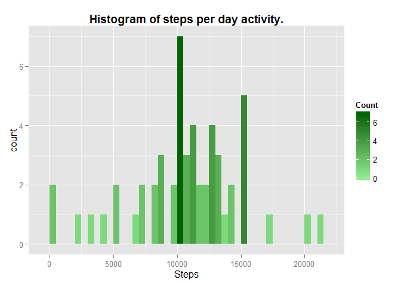
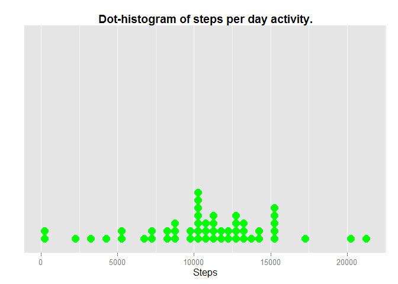
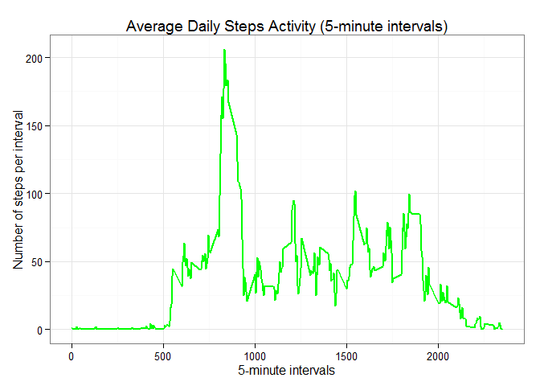
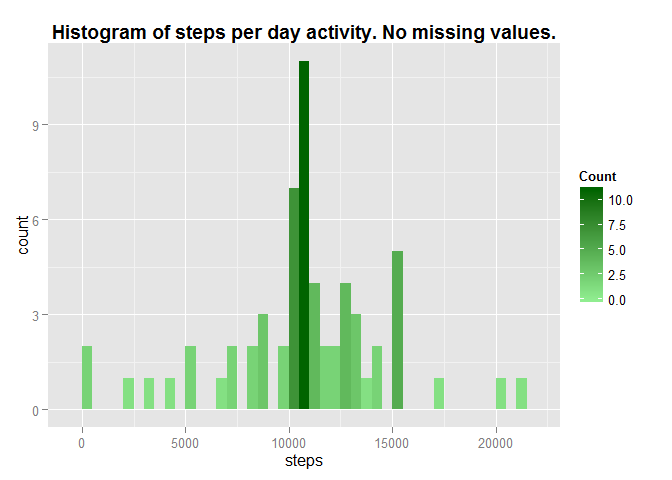
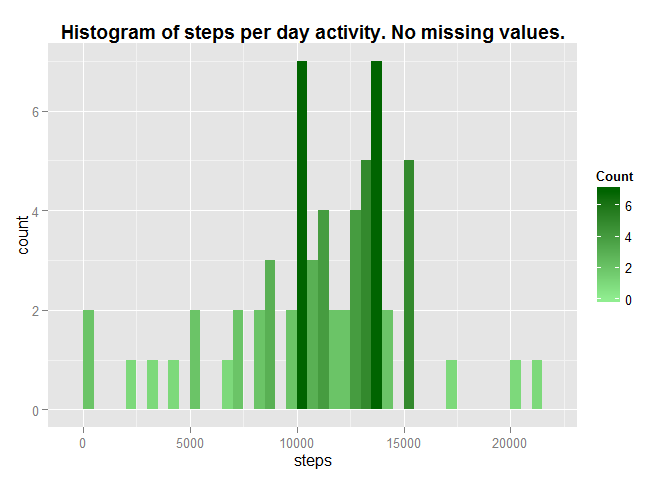
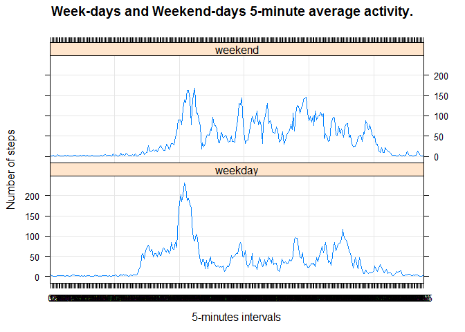
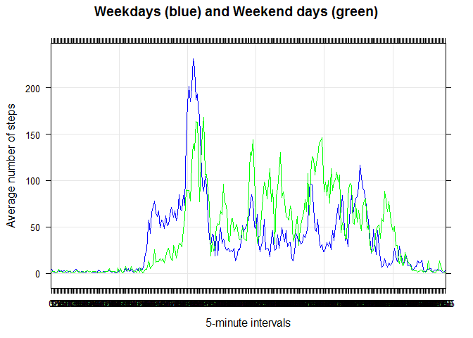

# PA1_template
pd  
Friday, May 15, 2015  

###Introduction

This is an R Markdown document related to the first assignment of Reproducible Research Coursera course.

###Loading and preprocessing the data
1.Load the data (i.e. read.csv())
The data for this assignment is in a zip file on the forked Github repository.

First, we initialize the environmentand some variables.

```r
version$version.string
```

```
## [1] "R version 3.1.2 (2014-10-31)"
```

```r
library(ggplot2)
```

```
## Warning: package 'ggplot2' was built under R version 3.1.3
```
2.Process/transform the data (if necessary) into a format suitable for your analysis
The file is unzipped, read, and some initial information about its data and structure is displayed.

```r
unzip("activity.zip")
activity <- read.csv("activity.csv", header=TRUE, sep=",")
#get an idea of the data and its structure
str(activity)
```

```
## 'data.frame':	17568 obs. of  3 variables:
##  $ steps   : int  NA NA NA NA NA NA NA NA NA NA ...
##  $ date    : Factor w/ 61 levels "2012-10-01","2012-10-02",..: 1 1 1 1 1 1 1 1 1 1 ...
##  $ interval: int  0 5 10 15 20 25 30 35 40 45 ...
```

```r
head(activity)
```

```
##   steps       date interval
## 1    NA 2012-10-01        0
## 2    NA 2012-10-01        5
## 3    NA 2012-10-01       10
## 4    NA 2012-10-01       15
## 5    NA 2012-10-01       20
## 6    NA 2012-10-01       25
```

###What is mean total number of steps taken per day?

For this part of the assignment, we ignore the records in the dataset with missing values.

1. Calculation the number of steps per day:

```r
steps_taken_per_day <- aggregate(steps ~ date, activity, sum, na.rm=TRUE)
colnames(steps_taken_per_day) <- c("Date", "Steps")
```
2. If you do not understand the difference between a histogram and a barplot, research the difference between them. Make a histogram of the total number of steps taken each day.

We present a histogram of the total number of steps taken daily, plotted with a binwidth of 500 steps. (The occurance distribution of step dayly activity grouped by number of steps.)

```r
ggplot(steps_taken_per_day, aes(x = Steps)) + 
      geom_histogram(aes(fill = ..count..), binwidth = 500) +
      scale_fill_gradient("Count", low = "lightgreen", high = "darkgreen") +
      ggtitle("Histogram of steps per day activity.") + 
      theme(plot.title = element_text(lineheight=.8, face="bold"))
```

 

One interesting display is with histodot binning. Similarly to the histogram, the bins have a fixed positions and a specified widt but give a better visual display for the number of occurances with the same dayly activity. Histodot is a binning along the x-axis and stacking along the y-axis.

```r
ggplot(steps_taken_per_day, aes(x = Steps)) +
  geom_dotplot(method="histodot", binwidth = 500, fill="green", colour="green") +
  scale_y_continuous(name = "", breaks = NULL) +
  ggtitle("Dot-histogram of steps per day activity.") + 
  theme(plot.title = element_text(lineheight=.8, face="bold"))
```

 

Note: In this example, the y-axis is suppressed or has to be scaled to be with meaningful values. (it is a current deficiency of ggplot2.)

3. Calculate and report the mean and median of the total number of steps taken per day.

The mean and median of total number of steps taken per day are calculated with the missing data  removed. The **mean value is 10766.19** and **the median value is 10765**. 


###What is the average daily activity pattern?

1.Make a time series plot (i.e. type = "l") of the 5-minute interval (x-axis) and the average number of steps taken, averaged across all days (y-axis).
For this task, the number of steps for 5-minute intervals are calculated and coerce to integer values. The colons of the result are labeled and a plot of the average dayly number of steps taken versus the 5-minute intervals is generated.

```r
activity$interval <- factor(activity$interval)
activity$date <- as.Date(activity$date, format="%Y-%m-%d")
steps_per_interval <- aggregate(activity$steps, by = list(interval = activity$interval),
                      FUN=mean, na.rm=TRUE)
# convert to integers and plotting
steps_per_interval$interval <- 
        as.integer(levels(steps_per_interval$interval)[steps_per_interval$interval])
colnames(steps_per_interval) <- c("Interval", "Steps")
#plot
ggplot(steps_per_interval, aes(x=Interval, y=Steps)) +   
        geom_line(color="green", size=1) +  
        labs(title="Average Daily Steps Activity (5-minute intervals)", 
             x="5-minute intervals", y="Number of steps per interval") +  
        theme_bw() + theme(legend.position = "bottom")
```

 
2.Which 5-minute interval, on average across all the days in the dataset, contains the maximum number of steps?
The **835^th^ interval** has the maximum number of steps.


###Imputing missing values:
Note that there are a number of days/intervals where there are missing values (coded as NA). The presence of missing days may introduce bias into some calculations or summaries of the data.

1.Calculate and report the total number of missing values in the dataset (i.e. the total number of rows with NAs)
The total number of records with missing values (NA) is **2304**.

2. 2.Devise a strategy for filling in all of the missing values in the dataset. The strategy does not need to be sophisticated. For example, you could use the mean/median for that day, or the mean for that 5-minute interval, etc.
The mean/median is an option, and for this dataset the two values are very close. Uppon a closer examination of the average dayly activity, one can notice that the average steps per 5-minut intervals most-likely is a better approach. I select to replace the missing values with the mean value calculated for the same interval across the days with available data. 

```r
#for reference, recall the original dataset
str(steps_per_interval)
```

```
## 'data.frame':	288 obs. of  2 variables:
##  $ Interval: int  0 5 10 15 20 25 30 35 40 45 ...
##  $ Steps   : num  1.717 0.3396 0.1321 0.1509 0.0755 ...
```

3. Create a new dataset that is equal to the original dataset but with the missing data filled in.
I replace each record with missing steps value buy the average number of steps calculated for the same interval from all other dates with available data and verify it worked properly.

```r
datasetNoMiss <- activity
for(r in 1:nrow(datasetNoMiss)){
  if (is.na(datasetNoMiss$steps[r])) {
    repl <- steps_per_interval$Steps[steps_per_interval$Interval == datasetNoMiss$interval[r]]
    datasetNoMiss$steps[r] <- repl 
  }
}
# confirm the result: data structure and total missing before replacement
str(activity$steps)
```

```
##  int [1:17568] NA NA NA NA NA NA NA NA NA NA ...
```

```r
sum(is.na(activity$steps))
```

```
## [1] 2304
```

```r
#data structure and total missing after replacement
str(datasetNoMiss$steps)
```

```
##  num [1:17568] 1.717 0.3396 0.1321 0.1509 0.0755 ...
```

```r
sum(is.na(datasetNoMiss$steps))
```

```
## [1] 0
```

4. Make a histogram of the total number of steps taken each day and Calculate and report the mean and median total number of steps taken per day. Do these values differ from the estimates from the first part of the assignment? What is the impact of imputing missing data on the estimates of the total daily number of steps?

```r
sumStepsPerDayNoMiss <- aggregate(steps ~ date, datasetNoMiss, sum)
ggplot(sumStepsPerDayNoMiss, aes(x = steps)) + 
      geom_histogram(aes(fill = ..count..), binwidth = 500) +
      scale_fill_gradient("Count", low = "lightgreen", high = "darkgreen") +
      ggtitle("Histogram of steps per day activity. No missing values.") + 
      theme(plot.title = element_text(lineheight=.8, face="bold"))
```

 

The calculated values of the mean and median for the dataset with imputed missing values using the nember of steps per 5-minute intervas are respectively: **mean = 10766.19** and **median = 10766.19**.

The changes in the histogram are as a result from the additional data. Overall, the shape remains the same with noticeable elevation of some of the bins.

******************
The chosen imputing method for the missing values resulted in equalizing the mean and median values. To explore this further, I decided to add some random (integer) number of steps to the 5-minute interval values. Next plot is a repeat of the previous with the added random number of steps for the filled in missing data. For this particular example, I have used **floor(runif(1, min=0, max=21))** to add randomly up to 20 steps while imputing the missing values.


```r
datasetNoMiss <- activity
for(r in 1:nrow(datasetNoMiss)){
  if (is.na(datasetNoMiss$steps[r])) {
    repl <- steps_per_interval$Steps[steps_per_interval$Interval == datasetNoMiss$interval[r]]
    datasetNoMiss$steps[r] <- repl + floor(runif(1, min=0, max=21))
  }
}
```

The histogram has not changed noticeably.

```r
sumStepsPerDayNoMiss <- aggregate(steps ~ date, datasetNoMiss, sum)
ggplot(sumStepsPerDayNoMiss, aes(x = steps)) + 
      geom_histogram(aes(fill = ..count..), binwidth = 500) +
      scale_fill_gradient("Count", low = "lightgreen", high = "darkgreen") +
      ggtitle("Histogram of steps per day activity. No missing values.") + 
      theme(plot.title = element_text(lineheight=.8, face="bold"))
```

 

However, the calculated values of the mean and median for the dataset with imputed missing values using the nember of steps per 5-minute intervas and some random number of steps added are respectively: **mean = 11135.58** and **median = 11458**. Compared to the previous imputing method, in this case the mean and median are different values.

###Are there differences in activity patterns between weekdays and weekends?
For this part the "weekdays()" function may be of some help here. Use the dataset with the filled-in missing values for this part.

1. Create a new factor variable from the dataset with two levels - "weekday" and "weekend" indicating whether a given date is a week-day or weekend-day.

```r
datasetNoMiss$day <- "weekday"
datasetNoMiss$day[weekdays(as.Date(datasetNoMiss$date), abb=T) %in% c("Sat","Sun")] <- "weekend"
#datasetNoMiss$day contains "weekday" or "weekend".
table(datasetNoMiss$day)
```

```
## 
## weekday weekend 
##   12960    4608
```

2. Make a panel plot containing a time series plot (i.e. type = "l") of the 5-minute interval (x-axis) and the average number of steps taken, averaged across all weekday days or weekend days (y-axis). See the README file in the GitHub repository to see an example of what this plot should look like using simulated data.


```r
meanStepsPerIntervalNoMiss <- aggregate(steps ~ interval + day, data=datasetNoMiss, FUN="mean")
library(lattice)
xyplot(steps ~ interval | day, data=meanStepsPerIntervalNoMiss, type="l",
       grid=T, layout=c(1,2), ylab="Number of steps", xlab="5-minutes intervals", 
       main="Week-days and Weekend-days 5-minute average activity.")
```

 

The two plots illustrate that the number of steps are consistently higher for all intervals during the weekend days, whereas they have pick activity in the morning hours for weekdays. Superimposing the two plots Another representation would be supperposing both factors on the same graph:

```r
xyplot(steps ~ interval, data=meanStepsPerIntervalNoMiss, groups=meanStepsPerIntervalNoMiss$day,
       type="l", grid=T, col = c("blue", "green"), ylab="Average number of steps", 
       xlab="5-minute intervals", main="Weekdays (blue) and Weekend days (green)")
```

 

********
End of file.
